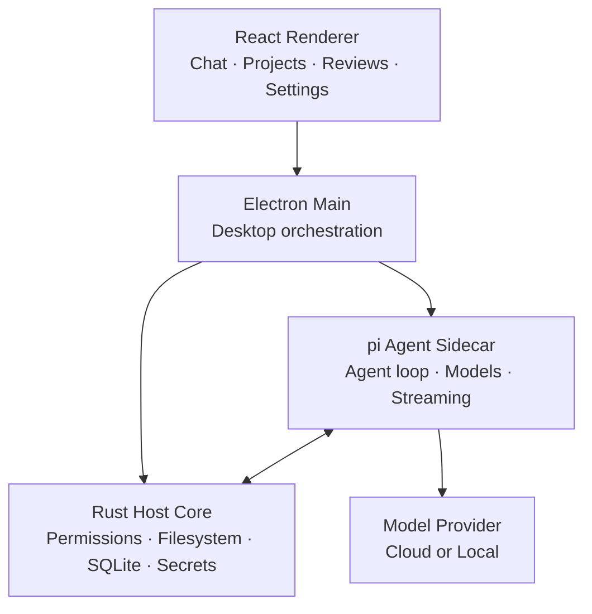

<div align="center">


# PI-Desktop (Enhanced v0.14.8)

### The desktop workspace for AI coding agents.

**Bring your own model. Open any local project. Let agents work — while you stay in control.**

Local-first · Model-agnostic · Antigravity OAuth · Live Usages · Todo & Plan · macOS / Windows / Linux

<br />

[](https://github.com/Elaina2026/PI-Desktop/releases/latest)
[](https://github.com/Elaina2026/PI-Desktop/stargazers)
[](LICENSE)

<br />

**[Download Latest Build](https://github.com/Elaina2026/PI-Desktop/releases/latest)** ·
[Documentation](https://pi-docs.aiuo.net/) ·
[Changelog](CHANGELOG.md) ·
[Screenshots](docs/guide/screenshots.md) ·
[Build a Plugin](docs/plugin-development.md) ·
[简体中文](README.zh-CN.md)

<br />


<br />

**No PI-Desktop account. No mandatory relay. No editor lock-in.**

<sub>Projects and sessions stay on your machine. Model requests go directly to the provider or endpoint you configure.</sub>

<br /><br />

</div>

---

## ✨ Enhanced Features (Custom Edition)

This fork updates PI-Desktop to upstream **v0.14.8** while extending it with powerful capabilities for professional development:

- **🚀 Antigravity (Google Cloud Code Assist) OAuth & Quota System**:
  - One-click Google OAuth sign-in for Antigravity models (Gemini 3.8 Flash / Pro, Claude 3.5 Sonnet via Code Assist).
  - Multi-account connection pool with live 4-group quota monitoring (5-hour rolling & weekly reset countdowns).
  - Automatic quota exhaustion handling (`0% Đã khóa / Hết hạn mức`) and transparent token refresh on HTTP 401.
  - Automatic vendor account failover on rate limits (`HTTP 429`) or quota exhaustion without interrupting ongoing turns.

- **📊 9Router-Style Usages Dashboard & Activity Analytics**:
  - Dedicated **Usages** view with responsive SVG contribution calendar heatmap.
  - Comprehensive model catalog pricing calculations for prompt, completion, and cache tokens.
  - Model key prefix normalization (`ag/`, `google/`, `anthropic/`) eliminating duplicate statistics.
  - Live session token consumption bar directly in the conversation topbar.

- **📝 Native Todo Checklist & Plan Workflow**:
  - WorkPanel `todo-plan` tab with markdown preview and single-click task synchronization.
  - Automated checklist extraction from plan documents (`extractTodosFromPlanMarkdown`).
  - Standalone natural Todo checklist in Chat Transcript (completed, in-progress with `*`, and pending states) rendered outside collapsible tool groups.
  - Global plan persistence in `~/.pi-desktop/plans/` (mirrored to `~/.pi/plan/`) and auto-binding workspace to sessions in SQLite to prevent `PLAN_WORKSPACE_REQUIRED` errors.

- **🤖 Subagent File Inspection & Output Cleaning**:
  - Open and inspect subagent markdown files (`~/.agents/subagents/developer.md`) and project skills directly from chat.
  - Automatic path resolution and `fsExtraRoots` expansion for dot-directories.
  - Clean rendering of subagent XML tags (`<review_report>`, `<verdict>`, `<vuln>`, `<finding>`) in Markdown output.

- **⚡ Productivity Personas & Compressors**:
  - Built-in prompt engineering modes: **Caveman** (high-signal terse output), **Ponytail** (minimal diffs, YAGNI, standard library first), and **RTK compressor** for maximum token efficiency.

---

> [!IMPORTANT]
> **PI-Desktop is in Early Preview.** It is already usable for real coding workflows, while APIs, extension interfaces, and some desktop behaviors are still evolving.

## Not another chat window

Most coding agents live inside a terminal, an editor extension, or a hosted service.

**PI-Desktop gives the agent workflow a workspace of its own.**

Projects, sessions, files, reviews, previews, models, permissions, extensions, and long-running work live together — without tying your workflow to a single editor, model vendor, or hosted runtime.

<table>
<tr>
<td width="50%" valign="top">

### Your models

Use OpenAI, Anthropic, local models, hosted gateways, or any OpenAI-compatible API.

Configure multiple providers, context windows, output limits, reasoning levels, and model-specific behavior. Switch models directly from the Composer without recreating the session.

</td>
<td width="50%" valign="top">

### Your projects

Open a local repository or project directory and keep its sessions, files, reviews, previews, and agent work in one place.

Import existing local sessions from Claude Code, Codex, OpenCode, and Pi.

</td>
</tr>
<tr>
<td width="50%" valign="top">

### Your control

Agents can read files, edit code, and run commands, while privileged actions pass through PI-Desktop's permission layer.

Inspect diffs. Review command output. Decide how much autonomy each session gets.

</td>
<td width="50%" valign="top">

### Your extensions

Add Skills, MCP servers, Subagents, pi extensions, and installable Plugins.

Extend the agent **and** the desktop instead of waiting for every workflow to become a built-in feature.

</td>
</tr>
</table>

---

## One workspace. Three ways to work.

Same agent. Different approval boundaries.

| | **Agent** | **Plan** | **Goal** |
| --- | --- | --- | --- |
| **You approve** | Nothing extra | The implementation plan | The outcome and acceptance criteria |
| **The agent does** | Reads, edits, runs commands, tests, iterates | Studies the repo, writes a frozen plan, then waits | Chooses the path and works toward the goal |
| **Best for** | Fast day-to-day work | Large or risky changes | Outcome-first tasks |

**Agent** — let it inspect the tree, patch files, run commands, test, and keep going.

**Plan** — review the approach before execution. The agent researches first, produces an immutable implementation plan, and waits for approval.

**Goal** — lock the objective and acceptance criteria. The agent decides how to get there.

Privileged tools still go through the permission layer in every mode.

---

### Delegate work to Subagents

Large tasks rarely belong in one context window.

PI-Desktop can delegate independent work to background Subagents for things like:

* codebase exploration
* multi-file implementation
* research and investigation
* test analysis
* adversarial review

Each Subagent runs in its own context and reports its result back to the parent agent.

---

### A workspace built for long sessions

PI-Desktop is designed for more than one prompt at a time.

You can manage multiple projects and sessions, pin or archive conversations, branch sessions, queue prompts while an agent is running, reference files with `@`, use slash commands, and search across the application.

Streaming responses are checkpointed so interrupted work can survive application restarts or runtime failures whenever possible.

---

## Your models, your choice

PI-Desktop does not lock the agent runtime to a hardcoded model list.

Use:

* OpenAI, Anthropic, and Google Cloud Code Assist (Antigravity)
* OpenAI-compatible APIs
* hosted model gateways
* local gateways such as Ollama and LM Studio
* multiple models under the same provider with dynamic Thinking level mapping
* multi-account OAuth pools with automatic failover on quota exhaustion
* granular quota tracking across rolling 5-hour and weekly windows

Model configuration can include context windows, output limits, reasoning controls, temperature, and other model-specific behavior.

Switch models directly from the Composer without recreating your session.

---

## See the work, not just the answer

<table>
<tr>
<td width="50%">


<p align="center"><sub>Long-running conversations with transcript navigation</sub></p>

</td>
<td width="50%">


<p align="center"><sub>Switch providers, models, and reasoning levels per session</sub></p>

</td>
</tr>
<tr>
<td width="50%">


<p align="center"><sub>Extend the workspace through the plugin marketplace</sub></p>

</td>
<td width="50%">


<p align="center"><sub>Add a provider and connect a model</sub></p>

</td>
</tr>
</table>

<p align="center">
<a href="docs/guide/screenshots.md"><strong>Explore all screenshots →</strong></a>
</p>

---

## Built for work that lasts longer than one prompt

PI-Desktop is designed around persistent projects and long-running sessions rather than disposable chat threads.

- Manage multiple projects and sessions
- Pin, archive, branch, and search conversations
- Queue prompts while an agent is already running
- Reference files with `@`
- Use slash commands
- Review diffs and command output
- Keep streaming responses checkpointed so interrupted work can recover whenever possible

### Delegate to Subagents

Large tasks do not have to live in one context window.

Delegate independent work to background Subagents for:

- codebase exploration
- multi-file implementation
- research and investigation
- test analysis
- adversarial review

Each Subagent runs in its own context and reports its result back to the parent agent.

---

## Extend the workspace instead of rebuilding it

PI-Desktop has multiple extension layers, from lightweight reusable instructions to full desktop integrations.

### Plugins

Plugins can extend PI-Desktop with:

| Agent | Workspace | Platform |
| --- | --- | --- |
| Agent tools | Commands | MCP servers |
| Skills | Workspace panels | Subagents |
| pi extensions | Work-panel views | Resident services |
|  | Themes | Inter-plugin messaging |

Install plugins locally or through the marketplace using the `.piplug` package workflow.

**[Build your first plugin →](docs/plugin-development.md)**

> [!NOTE]
> Plugin processes are permission-gated and isolated from the renderer, but plugins are still user-trusted code rather than a complete operating-system sandbox. Only install plugins you trust.

### Skills

Give agents reusable instructions and workflows. Skills can be installed globally or activated for individual projects.

### MCP

Connect external tools and services through Model Context Protocol servers without baking them into the desktop application.

PI-Desktop can also be controlled by an external MCP Agent. Start the app with `PI_DESKTOP_MCP_CONTROL=1`, then read the loopback endpoint and bearer token from `mcp-control.json` in the Electron user-data directory.

The control endpoint supports project, session, and Agent workflows plus a reviewed desktop operation catalog. It is disabled by default, binds to loopback only, and grants the calling local Agent the same authority as the desktop for those operations. `confirm: true` is not a user prompt.

### pi extensions

Extensions written for the [pi](https://github.com/badlogic/pi-mono) CLI can run inside PI-Desktop's agent unchanged.

A plugin can list them under `contributes.agentExtensions`, or **Plugins → Import pi extension** can wrap an existing extension file or directory in a plugin. If the directory declares production or optional npm dependencies, a system `npm` on `PATH` performs a bounded registry-only install before first load (`--ignore-scripts`, so no third-party install script ever runs); release builds do not include standalone Node/npm.

They can register tools, slash commands, and hooks on every turn, tool call, and provider request. They run with the same access as the agent's own tools, gated by the `agent.extension` permission.

---

## Bring the model you want

PI-Desktop does not hardcode your agent workflow to one model vendor.

Use:

- OpenAI and Anthropic
- OpenAI-compatible APIs
- hosted model gateways
- local gateways such as Ollama and LM Studio
- multiple models under the same provider
- provider OAuth accounts where supported

Per-model configuration can include context windows, output limits, reasoning controls, temperature, and other model-specific behavior.

**The model is a replaceable part of the workflow — not the workflow itself.**

---

## Local-first, precisely

PI-Desktop is **local-first**, not “nothing ever touches the network.”

| Data | Behavior |
| --- | --- |
| Conversations | Stored locally as JSONL with a SQLite index |
| Settings | Stored on your machine |
| API credentials | Stored in the operating system keychain |
| Logs | Local |
| PI-Desktop telemetry | None |
| Model requests | Sent directly to the provider or endpoint you configure |

There is no required PI-Desktop account and no mandatory PI-hosted relay between your machine and your model provider.

If you use a remote model provider, the context required for that model request is sent to that provider according to its own privacy policy.

---

## From install to first patch

1. **Download PI-Desktop**
   Get the latest build from [GitHub Releases](https://github.com/vastsa/PI-Desktop/releases/latest).

2. **Connect a model**
   Open **Settings → Model configuration**, choose a provider or compatible API, and add your credentials.

3. **Open a project**
   Add any local repository or project directory from the sidebar.

4. **Choose Agent, Plan, or Goal**
   Start immediately, approve an implementation plan first, or define the outcome and let the agent choose the path.

5. **Review the result**
   Inspect edits in the Review panel, check command output, preview the application, and continue without leaving PI-Desktop.

---

## Download

**[Download the latest release →](https://github.com/vastsa/PI-Desktop/releases/latest)**

| Platform | Architecture | Package |
| --- | --- | --- |
| macOS | Apple Silicon | `.dmg` / `.zip` |
| macOS | Intel | `.dmg` / `.zip` |
| Windows | x64 | NSIS installer / portable `.exe` |
| Linux | x64 | `.AppImage` / `.deb` / `.rpm` / `.asar` |

Packaged builds can check GitHub Releases for updates and surface new versions inside the application.

Windows NSIS and Linux AppImage can download and install updates in-app. macOS, Linux deb/rpm, and the Windows portable executable open the releases page.

<details>
<summary><strong>Linux compatibility</strong></summary>

<br />

Linux x64 packages require **glibc 2.35** or newer, including:

- Ubuntu 22.04 or later
- Debian 12 or later
- Fedora 36 or later

Ubuntu 20.04, Debian 11, Fedora 35, and older releases cannot load the bundled host.

Check your version with:

```bash
ldd --version
```

The Linux `.asar` asset is also available for repackaging with a system Electron:

```bash
electron PI-Desktop-<version>-linux-x64.asar
```

The target distribution still needs the required native host and packaged resources.

</details>

<details>
<summary><strong>macOS unsigned-build notes</strong></summary>

<br />

The tagged-release workflow publishes unsigned macOS artifacts by default.

For a trusted unsigned install, move `PI-Desktop.app` to `/Applications` and open it. If macOS reports the app as damaged or refuses to open it:

1. Confirm the app came from a trusted PI-Desktop release.
2. Move `PI-Desktop.app` to `/Applications`.
3. Run:

```bash
xattr -r -d com.apple.quarantine /Applications/PI-Desktop.app
```

4. Open PI-Desktop again.

The DMG includes `If app won't open, read this.txt`. The ZIP also includes `PI-Desktop-macOS-open.command`, which performs the same trusted-source fallback after the app is moved to Applications.

The command only removes Apple's quarantine attribute. Do not use it for an untrusted app.

A manually dispatched run with `sign_macos: true` signs, notarizes, and staples macOS artifacts with Developer ID credentials before publication; signed builds do not need this fallback.

</details>

### Code signing

Windows releases of PI-Desktop are digitally signed with free code signing provided by [SignPath.io](https://signpath.io/), using a certificate from the [SignPath Foundation](https://signpath.org/).

---

## Bring your existing sessions

Already using another coding agent?

PI-Desktop can import local sessions from:

- Claude Code
- Codex
- OpenCode
- Pi

Open **Settings → Import** to bring existing work into the desktop workspace.

---

## Architecture

PI-Desktop separates the user interface, privileged host capabilities, and the agent loop.



The renderer has no Node integration.

The **Rust Host Core** owns privileged workspace operations, permissions, persistence, and secrets. The **pi Agent Sidecar** owns model interaction and the agent loop. Electron coordinates the desktop lifecycle while keeping those responsibilities separated.

**[Read the architecture specification →](docs/spec/02-architecture/01-architecture.md)**

---

## Built on pi

PI-Desktop builds on the excellent work of the [pi-mono](https://github.com/badlogic/pi-mono) ecosystem.

The agent runtime uses `pi-ai` and `pi-agent-core`.

**Pi provides the agent engine. PI-Desktop turns it into a persistent desktop workspace.**

The desktop application also uses technologies including Electron, React, TypeScript, Rust, SQLite, Vite, Tailwind CSS, Shiki, Mermaid, KaTeX, TypeBox, and i18next.

---

## Project status

PI-Desktop is an early preview under active development.

The current **0.14.x** line includes the desktop shell, streaming agent runtime, Agent / Plan / Goal workflows, permission-aware workspace tools, projects and sessions, session imports, local MCP control, MCP / Skills / Subagents, background delegation, multi-provider model configuration, plugins and marketplace support, context checkpoints, notifications, release notes, and cross-platform packaging.

Current priorities include:

- macOS tagged-release qualification
- installer upgrade and rollback qualification
- continued runtime and session-recovery hardening
- stronger plugin sandboxing and publisher verification
- broader UI-driven end-to-end coverage

Follow development through the [project board](docs/project/BOARD.md) and [milestones](docs/spec/06-delivery/01-mvp-milestones.md).

---

## Development

<details open>
<summary><strong>Run PI-Desktop locally</strong></summary>

<br />

### Requirements

- Node.js `>=22.19`
- pnpm `>=10`
- stable Rust toolchain

The repository currently pins pnpm 11, while CI and release builds use Node 24.

### Start

```bash
git clone https://github.com/vastsa/PI-Desktop.git
cd PI-Desktop

pnpm install

cargo build -p host-core
pnpm build:js

pnpm dev
```

### Validate changes

```bash
pnpm typecheck
pnpm lint
pnpm test
```

Additional protocol, Plan, supervision, Subagent, and Electron E2E suites are documented in the repository specification.

</details>

### Documentation

```bash
pnpm docs:dev
pnpm docs:check
```

Useful references:

- [Documentation](https://pi-docs.aiuo.net/)
- [Specification index](docs/spec/README.md)
- [Architecture](docs/spec/02-architecture/01-architecture.md)
- [Product scope](docs/spec/01-product/01-product-scope.md)
- [Plugin development](docs/plugin-development.md)
- [E2E test plan](docs/spec/06-delivery/04-e2e-test-plan.md)
- [Release runbook](docs/spec/06-delivery/06-release-runbook.md)
- [Repository agent guide](AGENTS.md)

---

## Contributing

Issues, bug reports, feature proposals, documentation improvements, plugins, Skills, MCP integrations, and pull requests are welcome.

For larger changes, opening an issue first makes it easier to align the implementation with the existing architecture and product contracts.

When working in the repository, start with [AGENTS.md](AGENTS.md) and the [specification index](docs/spec/README.md).

**[Report an issue](https://github.com/vastsa/PI-Desktop/issues/new/choose)** ·
[View open issues](https://github.com/vastsa/PI-Desktop/issues) ·
[Build a plugin](docs/plugin-development.md)

---

## Model acknowledgements

> **Not by a lone genius, but by a token-powered construction crew.**

This project was created with the models below.

<details>
<summary><strong>View model usage — 27,144,044,009 listed tokens</strong></summary>

<br />

| Provider | Model | Tokens |
| --- | --- | ---: |
| OpenAI | `gpt-5.6-luna` | 5,304,019,817 |
| OpenAI | `gpt-5.6-sol` | 4,825,458,273 |
| OpenAI | `gpt-5.4` | 4,213,269,324 |
| Anthropic | `claude-opus-5` | 3,909,952,653 |
| OpenAI | `gpt-5.5` | 3,800,382,171 |
| xAI | `grok-4.5` | 1,947,736,115 |
| xAI | `grok-4.6` | 797,233,571 |
| DeepSeek | `deepseek-v4-flash` | 329,790,234 |
| OpenAI | `gpt-5.2-codex` | 320,983,170 |
| Xiaomi | `mimo-v2.5-pro` | 304,822,052 |
| Anthropic | `claude-fable-5-1` | 302,580,552 |
| OpenAI | `gpt-5.6-terra` | 274,107,085 |
| OpenAI | `gpt-5.3-codex` | 255,366,945 |
| OpenAI | `gpt-5.1-codex-max` | 220,947,212 |
| OpenAI | `gpt-5.1` | 142,533,699 |
| — | `Unknown model` | 69,801,632 |
| Anthropic | `claude-opus-4.6` | 55,223,768 |
| Zhipu | `stealth/ox-alpha` | 22,954,876 |
| Anthropic | `claude-fable-5` | 16,116,907 |
| OpenAI | `gpt-5.1-codex-mini` | 12,895,478 |
| Xiaohongshu | `dots-3-note-prev` | 10,166,895 |
| OpenAI | `gpt-5.1-codex` | 3,916,509 |
| Xiaomi | `mimo-v2.5` | 3,785,071 |

**Total for listed models:** 27,144,044,009 tokens.

</details>

---

## Community

- [Linux.Do](https://linux.do/) — Share, discuss, and follow development with the community.

---

## License

PI-Desktop is licensed under the **GNU Lesser General Public License v3.0**.

See [LICENSE](LICENSE) for details.

---

<div align="center">

### Build with the model you want. Keep the workflow yours.

**[Download PI-Desktop](https://github.com/vastsa/PI-Desktop/releases/latest)**

<sub>macOS · Windows · Linux</sub>

</div>
